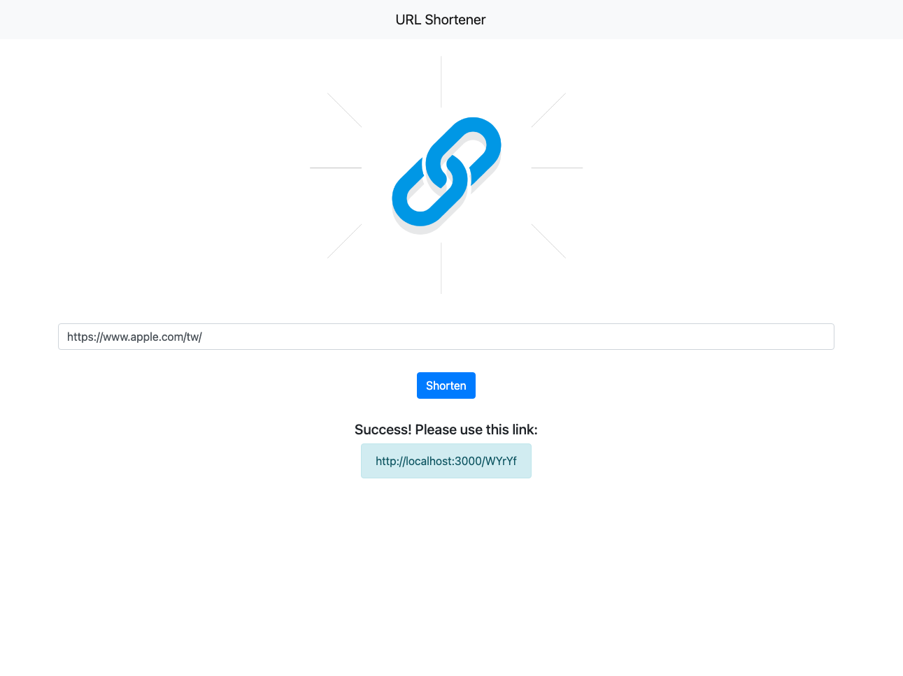

# URL Shortener

透過 Node.js/ Express/ MongoDB 打造的短網址產生器

## Features

1. 首頁畫面上有一個表單，使用者可以在表單輸入原始網址，如 `https://www.google.com`
2. 送出表單之後，畫面會回傳格式化後的短網址，如 `https://your-project-name.herokuapp.com/6y7UP`
3. 在伺服器啟動期間，使用者可以在瀏覽器的網址列，輸入你提供的短網址，如 `https://your-project-name.herokuapp.com/6y7UP`，瀏覽器就會導向原本的網站，如 `https://www.google.com`

## Preview



## Prerequisites

- [Git](https://git-scm.com/)
- [Node.js](https://nodejs.org/en/)
- [Express](https://expressjs.com/)

## Installing

1. 打開終端機 (Terminal) 輸入以下訊息，下載專案至本機

```
git clone https://github.com/juifengchi/url-shortener.git
```

2. 進入專案目錄資料夾

```
cd url-shortener
```

3. 安裝 npm 套件

```
npm install
```

4. 啟動伺服器來執行專案

```
npm run dev
```

5. 出現以下訊息即可打開瀏覽器輸入 http://localhost:3000 開始使用

```
App is running on http://localhost:3000
```
